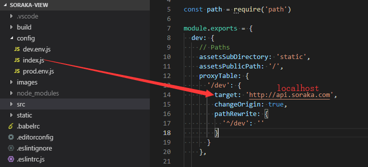

# 登陆问题

#### 用户名密码

默认用户：soraka

默认密码：123456

其他用户名和密码查询`sys_user`表

#### 登陆超时，504等问题

1. 检查hosts文件有没有添加 `127.0.0.1 api.soraka.com` ，确保 `api.soraka.com` 域名可以正常访问

2. 如果本地网络有限制，不能更改hosts文件或者更改之后不生效，可以到前端项目中 `soraka-view/config/index.js` 更改 `api.soraka.com` 为 `localhost` 

   

# 实体类没有getter和setter方法

项目使用lombok插件来减少开发工作量，getter和setter有lombok自动生成，需要安装插件。

在IDEA插件中心搜索`lombok`，直接点击安装，安装成功后需要重启。

