# 运行环境

#### 后端编译、运行环境

| 名称          | 版本   | 说明         | 官网                                                         |
| ------------- | ------ | ------------ | ------------------------------------------------------------ |
| JDK           | 1.8+   | 运行环境     | https://www.oracle.com/technetwork/java/javase/downloads/jdk8-downloads-2133151.html |
| Maven         | 3.5.2+ | 项目构建管理 | http://maven.apache.org                                      |
| MySQL         | 5.7+   | 数据库       | https://www.mysql.com/downloads/                             |
| Lombok        |        | IDE插件      |                                                              |
| Intellij IDEA | 2018   | 推荐IDE      |                                                              |
|               |        |              |                                                              |
|               |        |              |                                                              |

#### 前端技术选型

| 名称    | 版本    | 说明                   | 官网                           |
| ------- | ------- | ---------------------- | ------------------------------ |
| webpack | 4.16.5+ | 前端项目构建           | <https://webpack.github.io/>   |
| nodejs  | 6.0.0+  | 运行环境               | <https://nodejs.org/en/>       |
| npm     | 3.0.0+  | 包管理工具             | <https://www.npmjs.com/>       |
| python  | 3.6+    | 前端编译需要Python环境 | https://www.python.org/        |
| VS code | 1.29+   | 推荐IDE                | https://code.visualstudio.com/ |
|         |         |                        |                                |

# 引入项目

码云项目地址：https://gitee.com/beiyoufx/soraka

建议fork项目到自己的项目中，本文以作者仓库为例。

## 下载项目代码到本地

- 首先拷贝项目链接 ` git@gitee.com:beiyoufx/soraka.git`

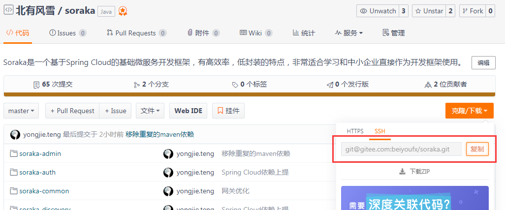

- 使用git工具clone项目代码到本地（或者是用IDEA自带git直接clone也可以）

  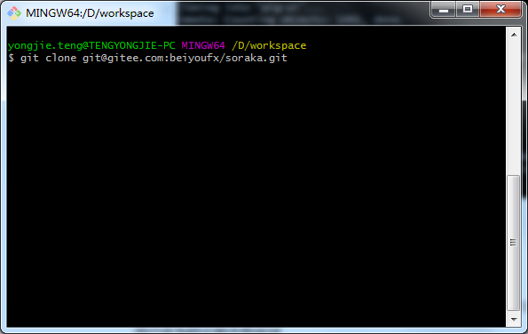

## 初始化工作空间

- 配置Maven

  默认版本较低，这里我们使用自己安装的版本

  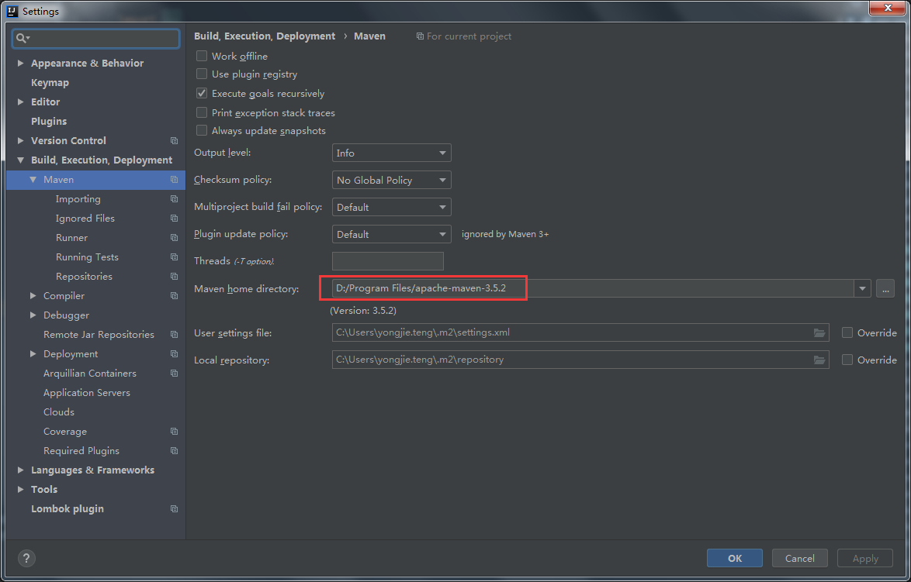

- 安装`lombok`插件

  在IDEA插件中心搜索`lombok`，直接点击安装，安装成功后需要重启（作者这里已经安装过了，显示的是uninstall）

  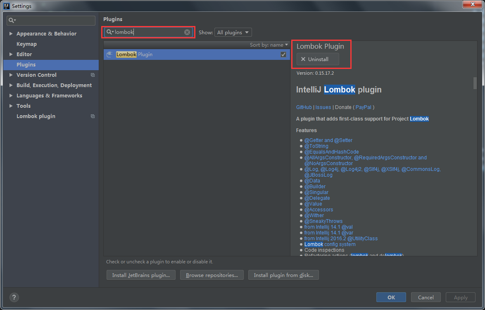

- 导入`Soraka`

  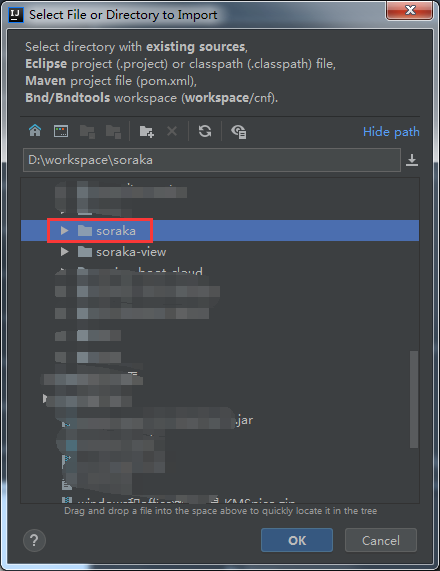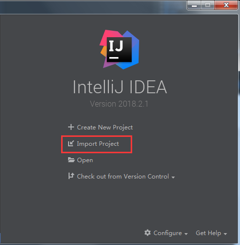

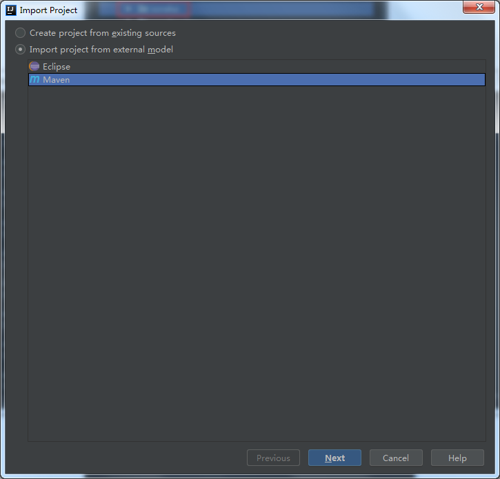


这里推荐使用`.ipr`文件作为项目结构文件，方便管理

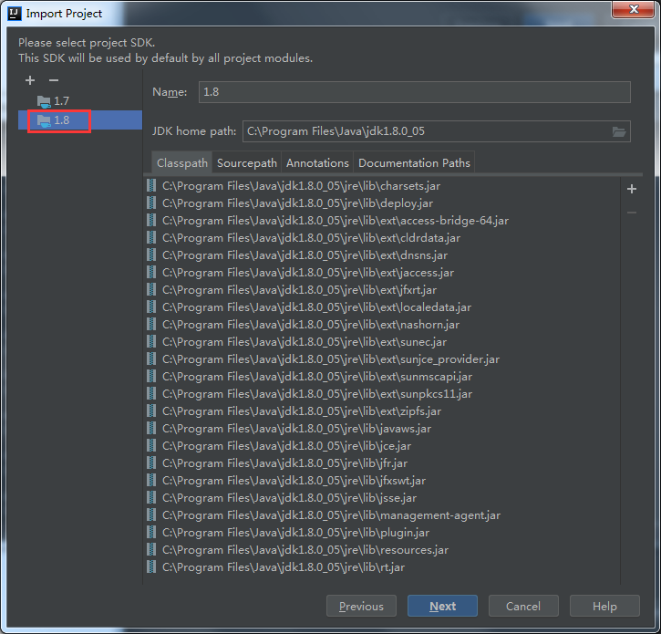

JDK选择1.8，如果没有点击`+`号新建

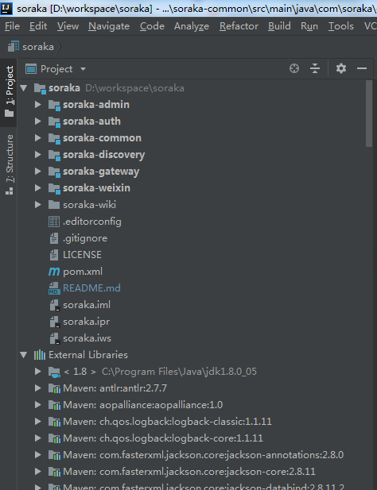

这就是导入之后的项目结构

# 运行项目

**首先确保数据库安装完毕，数据库字符编码使用utf8-mb4**

### 运行后端项目

- 创建数据库，脚本位置 `soraka\soraka-admin\soraka-init.sql`

  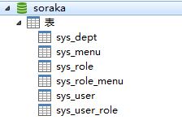

- 修改数据库配置

  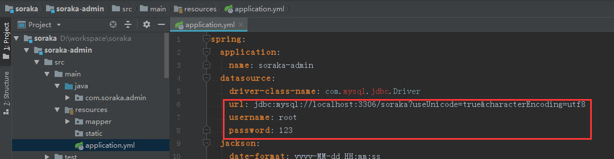

- 依次启动`soraka-discovery`、`soraka-admin`、`soraka-auth`、`soraka-gateway`

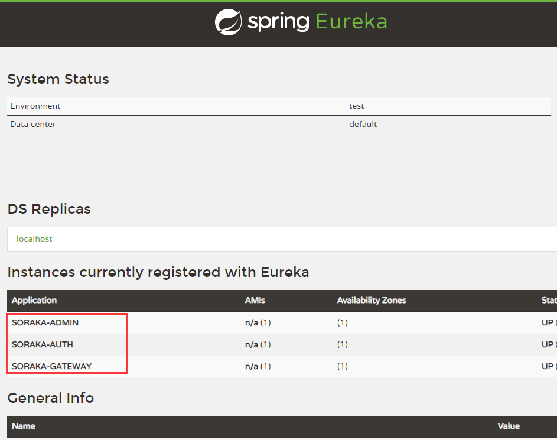

通过注册中心 http://localhost:8001/ 进行验证后端项目启动情况

## 更改本地hosts文件

为了方便进行集群测试，请在本地hosts文件中添加以下行：

`127.0.0.1 api.soraka.com`

## 运行前端项目

- 首先clone前端项目到本地 `git@gitee.com:beiyoufx/soraka-view.git`

- 在根目录运行命令

```
npm install

npm run dev
```

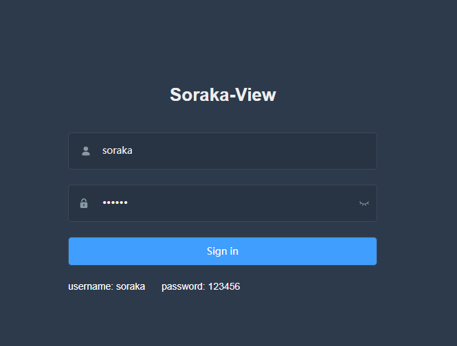